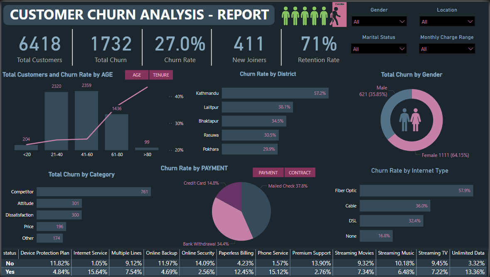

# 📊 Telecom Customer Churn Analysis – Power BI Project

This project aims to analyze customer churn behavior in a telecom company using Power BI. With a focus on identifying patterns and root causes of customer churn, the dashboard provides actionable insights for retention strategies and improving customer satisfaction.

## 🚀 Project Objective

To build an interactive Power BI dashboard that visualizes and explores telecom customer churn patterns based on demographics, geographics, services used, and payment methods etc helping stakeholders reduce churn and improve customer retention.

## 📁 Dataset

- **Source**: CSV file
- **File Name**: `Customer_Data.csv`
- **Records**: 6,418 customers
- **Columns**:
## Customer\_Data.csv

| Column Name                    | Data Type | Description                                         |
| ------------------------------ | --------- | --------------------------------------------------- |
| Customer\_ID                   | VARCHAR(50)      | Unique identifier for each customer                 |
| Gender                         | VARCHAR(50)      | Customer's gender                                   |
| Age                            | TINYINT   | Customer's age in years                             |
| Married                        | VARCHAR(50)      | Marital status (Yes/No)                             |
| State                          | VARCHAR(50)      | Customer's state of residence                       |
| Number\_of\_Referrals          | INTEGER   | Number of referrals made by the customer            |
| Tenure\_in\_Months             | INTEGER   | Duration of customer relationship in months         |
| Value\_Deal                    | VARCHAR(50)      | Whether the customer has a value deal               |
| Phone\_Service                 | VARCHAR(50)      | Availability of phone service                       |
| Multiple\_Lines                | VARCHAR(50)      | Use of multiple lines                               |
| Internet\_Service              | VARCHAR(50)      | Internet service availability                       |
| Internet\_Type                 | VARCHAR(50)      | Type of internet (e.g., Fiber Optic, DSL)           |
| Online\_Security               | VARCHAR(50)      | Availability of online security                     |
| Online\_Backup                 | VARCHAR(50)      | Availability of online backup                       |
| Device\_Protection\_Plan       | VARCHAR(50)      | Use of device protection plan                       |
| Premium\_Support               | VARCHAR(50)      | Availability of premium support                     |
| Streaming\_TV                  | VARCHAR(50)      | Access to streaming TV                              |
| Streaming\_Movies              | VARCHAR(50)      | Access to streaming movies                          |
| Streaming\_Music               | VARCHAR(50)      | Access to streaming music                           |
| Unlimited\_Data                | VARCHAR(50)      | Unlimited data plan                                 |
| Contract                       | VARCHAR(50)      | Type of contract (e.g., Month-to-month, Two year)   |
| Paperless\_Billing             | VARCHAR(50)      | Whether billing is paperless                        |
| Payment\_Method                | VARCHAR(50)      | Method of payment                                   |
| Monthly\_Charge                | FLOAT     | Monthly charge in currency                          |
| Total\_Charges                 | FLOAT     | Total charges incurred                              |
| Total\_Refunds                 | FLOAT     | Total refunds issued                                |
| Total\_Extra\_Data\_Charges    | INTEGER     | Charges for extra data usage                        |
| Total\_Long\_Distance\_Charges | FLOAT     | Charges for long distance calls                     |
| Total\_Revenue                 | FLOAT     | Total revenue generated from customer               |
| Customer\_Status               | VARCHAR(50)      | Current status of customer (Joined, Churned, Stayed) |
| Churn\_Category                | VARCHAR(50)      | Broad category of churn reason                      |
| Churn\_Reason                  | VARCHAR(50)      | Specific reason for churn                           |

## 🎯 Project Target

Create an **ETL process** & a Power BI dashboard to achieve following goals:
  - **Analyze Customer Demographic** (Age, Gender, Marital Status)
  - **Analyze Customer Geographic** (District-wise)
  - **Analyze Payment & Account Info** (Billing methods, Contracts)
  - **Analyze Services Usage** (Streaming, Internet, Backup, etc.)
  - **Analyze Churn Reason** and Identify Areas for Implementing Marketing Campaigns

---

## 📊 Required Metrics

- ✅ **Total Customers**
- ❌ **Total Churned Customers**
- 📉 **Churn Rate**
- ➕ **New Joiners**
- 📈  **Retentation Rate**

## 📌 Dashboard Summary

### 🔢 KPIs

- **Total Customers:** 6,418  
- **Total Churned Customers:** 1,732  
- **Churn Rate:** 27%  
- **New Joiners:** 411  
- **Retention Rate:** 71%

### 📊 Visualizations & Their Purposes

- **Customer & Churn Rate by Age Group and Tenure**: Understand which age brackets are most vulnerable to churn.
- **Churn Rate by District**: Identify geographic locations (e.g Kathmandu – 57.2%) with the highest churn for targeted interventions.
- **Churn by Gender**: Gender distribution shows 64% of churned customers are female.
- **Churn by Category**: Categorizes reasons for churn: Competitor, Attitude, Dissatisfaction, etc.
- **Churn by Payment & Contract Type**: Highlights churn trends by payment & contract methods.
- **Churn by Internet Type**: Fiber Optic users experience the highest churn at 57.9%.
- **Service Adoption vs. Churn Status**: Compares the impact of subscribing to different services (e.g streaming, security, backup) on churn.

### 🧠 Insights Derived

- Customers using **Mailed Check** payment are more likely to churn.
- **Fiber Optic** users show highest churn rate, may indicate service dissatisfaction.
- **Competitor switching** is the leading churn reason.
- Customers **without device protection,** **Online Security** etc have a higher churn rate.
- Majority of churned customers are from **Kathmandu**.

## 🛠 Tools Used

- Power BI (Dashboard & Visualizations)
- Power Query (Pre-cleaning)
- SQL Server for data source

## 💡 Business Impact

This dashboard enables stakeholders to:
- Prioritize retention efforts on specific customer segments (e.g Fiber optic users, Cable users etc).
- Design targeted marketing campaigns by location or age group.
- Improve payment options and service satisfaction.

## 📂 Repository Structure
```
Customer Churn Report/
|── dashboard/
|      ├── Customer_Churn.pbix              # Power BI Dashboard File
|      ├── Customer_Churn_Dashboard.png     # An Image of an Dashboard in PNG
|── docs/
|      ├── Customer_Churn.pbix              # Power BI Dashboard File
|      ├── Customer_Churn_Dashboard.png     # An Image of an Dashboard in PNG
|── README.md

```

## 📷 Dashboard Screenshot


