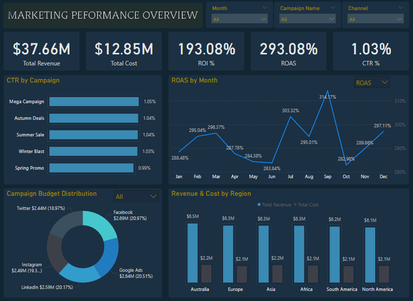

# Marketing Campaign Performance Report  
**🧑‍💼 Prepared by:** Nabin Tamang <br>
**📅 Report Date:** May 29, 2025  
**📊 Campaign Period:** May 2024 – May 2025  
**🧰 Tools Used:** Power BI and SQL Server <br>
**🎯 Goal:** Measure campaign effectiveness using ROI, ROAS, CTR, and understand where the budget is best spent.

---
## 🧾 Project Overview

In this project, I analyzed a company's year-long marketing data to understand how well different campaigns and channels performed. I created a Power BI dashboard to monitor key performance indicators (KPIs) such as **Total Revenue, Total Cost, ROI, ROAS, CTR**, and **Budget Allocation**.

The objective was to provide clear insights into what’s working, what’s not, and where marketing efforts should focus to get better results in the future.

## 📁 Dataset
- **File:** `marketing_campaign_data.csv`  
- **Description:** Contains marketing campaign year long data like campaign name, channel name, impressions, clicks, conversions, revenure, and more.
## 📦 Dataset Structure (Sample Columns)

| Column Name       | Data Type       | Description                                                                 |
|-------------------|-----------------|-----------------------------------------------------------------------------|
| `campaign_id`     | INTEGER         | Primary key uniquely identifying each campaign                              |
| `campaign_name`   | NVARCHAR(40)    | Title or name of the campaign                                               |
| `channel`         | NVARCHAR(30)    | Platform or social media where ads were shown (Facebook, Twitter, etc.)     |
| `region`          | VARCHAR(30)     | Geographic location where campaign ran                                      |
| `impressions`     | INTEGER         | Total number of times ads were shown                                        |
| `click`           | INTEGER         | Total number of times ads were clicked                                      |
| `conversions`     | INTEGER         | Number of successful conversions from the campaign                          |
| `cost`            | DECIMAL(10,2)   | Amount spent on the campaign                                                |
| `revenue`         | DECIMAL(10,2)   | Revenue generated from the campaign                                         |
| `start_date`      | DATE            | Start date of the campaign                                                  |
| `end_date`        | DATE            | End date of the campaign                                                    |

---
## 📝 Project Description

This analysis helps marketing teams track and improve performance across channels like Facebook, Google Ads, Twitter, Instagram, and more.

The dashboard addresses key questions:
- Which campaigns are performing best?
- What’s the overall ROI and ROAS?
- Which channels drive the most cost-effective results?
- How is budget distributed?
- Which regions deliver the highest returns?

---

## 🔍 Summary  
Analysis of one year marketing campaigns reveals:  
- **$37.66M revenue** generated from **$12.85M marketing spend**  
- **193.08% ROI** and **293.08% ROAS**  
- Strong overall performance with regional/platform variances  
- Key opportunities: CTR optimization and budget reallocation  

---

## 🎯 Objectives  
1. Analyze overall and channel specific campaign performance  
2. Identify top performing campaigns and channels by ROI/ROAS  
3. Examine regional revenue and costs  
4. Recommend budget optimization strategies  

---

## 📊 Key Metrics  
| KPI             | Value       |
|-----------------|-------------|
| Total Revenue   | $37.66M     |
| Total Cost      | $12.85M     |
| ROI             | 193.08%     |
| ROAS            | 293.08%     |
| CTR (Overall)   | 1.03%       |

---

## 🧩 Insights by Section  

### 📌 CTR by Campaign  
- Minimal CTR variation across campaigns (0.99% - 1.05%)  
- **Top performer:** Mega Campaign (1.05% CTR)  
- **Opportunity:** Creative/targeting improvements needed  

### 📌 Campaign Budget Distribution  
| Platform     | Budget       | Allocation |
|--------------|--------------|------------|
| Facebook     | $2.69M       | 20.97%     |
| Google Ads   | $2.64M       | 20.51%     |
| Twitter      | $2.44M       | 18.97%     |
| **Recommendation:** Monitor ROI/ROAS per platform for refined allocation  

### 📌 ROAS Trend by Month  
- **Peak performance:** September (314.47% ROAS)  
- **Notable dip:** October (283.98% ROAS)  
- **Opportunity:** Replicate September tactics seasonally  

### 📌 Revenue & Cost by Region  
| Region       | Revenue  | Cost       |
|--------------|----------|------------|
| Australia    | $6.5M    | ~$2.1-2.2M |
| Asia         | $6.3M    | ~$2.1-2.2M |
| Europe       | $6.3M    | ~$2.1-2.2M |
| **Insight:** Consistent costs with solid global ROI  

---

## 📍 Recommendations  
1. **Improve Click-Through Rate (CTR)**
  - The average CTR is only 1.03%, which is quite low.

  - What can we do: Try different ad images, and headlines. Also, test different audience segments to see who responds best.

2. **Spend More on High Performing Platforms**
  - Google Ads, Facebook, and Twitter received the most budget.

  - What can we do: Check which platform gives the best return (ROAS). Spend more on the ones that perform better and reduce spend on low-performing ones.

3. **Use September’s Strategy Again**
  - September had the highest ROAS (314.47%).

  - What can we do: Review what campaigns ran in September – what kind of ads, audience, and promotions were used. Use similar ideas in future months.

4. **Focus on Top Performing Regions**
  - Australia, Asia, and Europe brought in the most revenue.

  - What can we do: Consider spending more in these regions since they give better returns. we can also test new campaigns in these areas first.

---

## 📂 Repository Structure
```
Marketing Campaign Report/
|── dashboard/
|      ├── marketing_campaign_dashboard.png     # An Image of an Dashboard in PNG
|      ├── marketing_campaign_report.pbix       # Power BI Dashboard File
|
||── dataset/
|      ├── marketing_campaign_data.csv
|
|── docs/
|        
|── README.md

```

## 📷 Dashboard Screenshot



---

`Suggestions and feedback are welcome.`
